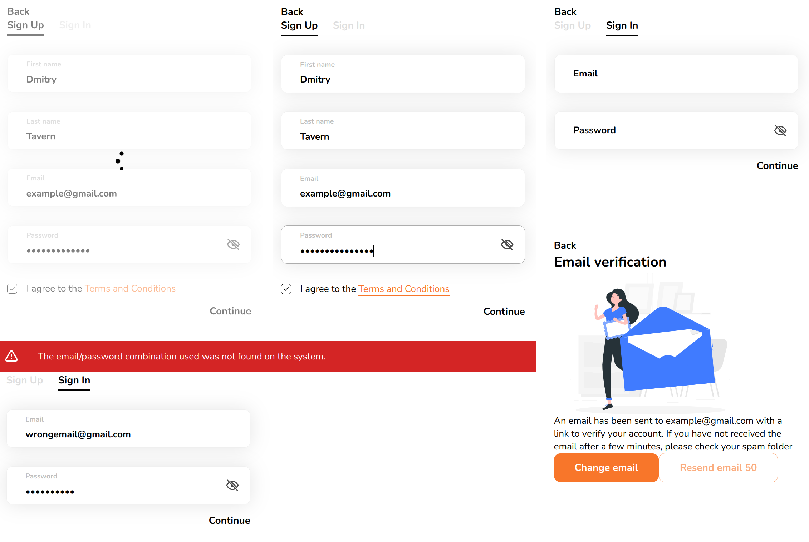

# Getting Started

Implementation of custom UI components similar to Material UI.

## Components list

- AppAlert
- AppButton
- AppButtonArrow
- AppButtonBase
- AppCheckbox
- AppForm
- AppInput
- AppInputPasswordIcon
- AppLoader
- AppSpinner
- AppTabControl
- AppTabPanel
- AppTabs

## How to install

1. Clone repo

```
git clone https://github.com/dmitrytavern/training-react-ui.git
```

2. Install deps

```
npm install
```

3. Start

```
npm start
```

## Screenshots


